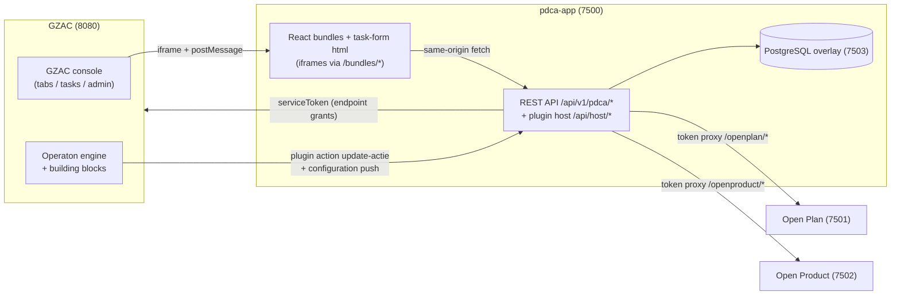

# PDCA app — Architecture & workings

**This document is the single source of truth for the design of the PDCA app.**
Every feature or behaviour change must update this document in the same change.
Setup and operating instructions live in
[`README.md`](./README.md); the GZAC configuration of the demo cases in
[`gzac/case-definitions/README.md`](./gzac/case-definitions/README.md).

## 1. What the app is

A standalone prototype for PDCA plan management (Plan-Do-Check-Act) that
connects two worlds:

- **Maykin's Common Ground registers** — [Open Plan](https://github.com/maykinmedia/open-plan)
  (plannen, doelen, instrumenten, contactmomenten, personen) and
  [Open Product](https://github.com/maykinmedia/open-product) (producttypen) are
  the system of record for all plan data.
- **Valtimo/GZAC** — the case management system in which the app runs as an
  *external plugin*: case tabs, task forms and an admin page as sandboxed
  iframes, and process execution (dossiers, tasks, building blocks) through the
  GZAC API.

The app itself is a single Spring Boot service (Kotlin, port 7500) with its own
PostgreSQL database for the **overlay**: only what the registers do not model.

## 2. System landscape

- The frontend **never** talks to the registers or GZAC directly: everything
  goes through the app's own backend (token injection, allowlists).
- GZAC talks to the app in both directions: it **fetches** the manifest and
  bundles, and it **pushes** plugin configurations (serviceToken) and plugin
  action calls to the app.

## 3. Design principles

1. **The registers are the source of truth.** The frontend consumes the
   register APIs in their *native* shape (Dutch camelCase, statuses
   `actief`/`afgerond`/`geannuleerd`, `{count, results}` pagination) through a
   thin token-injecting proxy (`/openplan/...`, `/openproduct/...`).
2. **The overlay is minimal** and keyed by register uuid. No copies of register
   data; only supplementary fields and links (see §5).
3. **Cross-register references are URNs**, e.g.
   `instrument.product = urn:pdca:openproduct:producttype:<code>` and
   `plan.domeinregister = urn:pdca:brp:persoon:<bsn>`.
4. **Plan = dossier, 1:1.** The link is a direct field in the overlay
   (`plan_details.dossier_id` = GZAC documentId, unique). The register field
   `plan.zaak` is not used.
5. **Configuration as code.** Case definitions and building blocks live as
   importable zips in `gzac/`; environment-specific values (such as plugin
   configuration UUIDs) do **not** belong in a zip and are resolved at runtime
   (pluginConfigurationMappings, see §9).
6. **Self-provisioning startup.** Init containers seed reference data into the
   registers; Liquibase provisions the overlay; the app needs no manual data
   steps.

## 4. Backend layout (`src/main/kotlin/com/ritense/pdca/`)

| Package | Responsibility |
|---|---|
| `config/` | Spring configuration: properties, CORS, security, register clients, startup info |
| `domain/` | JPA entities of the overlay (§5) |
| `repository/` | Spring Data repositories |
| `service/` | Domain logic: `ActionService`, `IntakeService`, `DossierLinkService`, `PhaseConfigService`, `ActieBouwblokService`, `GzacClient` |
| `web/rest/` | REST resources under `/api/v1/pdca/*` and `/api/v1/admin/*` |
| `plugin/` | The external-plugin host contract towards GZAC (§6): manifest, bundles, configuration push, plugin actions |
| `registers/` | Token proxy to Open Plan/Open Product and display-only stubs (`/api/v1/registers/*`) for registers out of scope (BRP, objects) |

### API surface (outline)

| Resource | Path | Purpose |
|---|---|---|
| `PdcaResource` | `/api/v1/pdca/{plandetails,doeldetails,instrumentdetails,contactmomentdetails}` | Overlay CRUD per register object |
| `ActieResource` | `/api/v1/pdca/acties` | Actions per doel (local and building block) |
| `BetrokkeneResource` | `/api/v1/pdca/betrokkenen` | Responsibilities/involved parties per plan |
| `EvaluatieResource` | `/api/v1/pdca/evaluaties?planUuid=` | Completed evaluations with their plan changes (§6.1); running ones are never listed |
| `DossierResource` | `/api/v1/pdca/dossiers/...`, `/plan-intake`, `/plans/{uuid}/dossier`, `/case-definitions` | Plan↔dossier link, prefill and creation routes (§7, §8) |
| `PhaseConfigResource` | `/api/v1/admin/phase-configs` | Case configuration per case definition (§10) |
| `ActieBouwblokResource` | `/api/v1/admin/actie-bouwblokken` (admin) and `/api/v1/pdca/actie-bouwblokken` (+ `/{id}/start`) | Action building blocks (§9) |
| `RegisterProxyController` | `/openplan/**`, `/openproduct/**` | Native register proxy with token injection |
| `PluginHostController` et al. | `/api/host/*`, `/bundles/*`, `/health`, `/plugins/{id}/{version}/...` | Plugin host contract (§6) |
| `PluginDataController` | `POST /plugins/pdca/{version}/data` | The contract's `/data` route: user-verified calls proxied by GZAC; evaluation sessions (§6.1) |

## 5. Overlay data model

All tables via Liquibase (`src/main/resources/config/liquibase/`:
`001-schema.xml` as the consolidated baseline, `002-seed-data.xml` for the
demo case configs, `003-subdoel-mapping.xml` for the subdoelmapping,
`004-drop-doelpositie.xml`, `005-plan-details-intake-dossier.xml`,
`006-evaluation-session.xml` and `007-evaluation-content.xml`; new changes
continue the numbering). Core:

| Entity | Key | Holds |
|---|---|---|
| `PlanDetails` | `planUuid` | `dossierId` (1:1, unique), `intakeDossierId` (the intake this plan came from, §7), `caseDefinitionKey`, execution status (gepland/gestart), plan display status, positie, subdoelgroep (W&P segmentation, advised by the intake DMN), hoofddoel type |
| `DoelDetails` | `doelUuid` | subdoelen and the hoofddoel: `VoortgangStatus` (OP_KOERS, AANDACHT_NODIG, LOOPT_ACHTER; how an active subdoel is going, shown in the plan tabs), internal and external note, sort order; plus the numeric `voortgangScore`/`voortgangToelichting` that the intake and the `evaluate` task form still write |
| `InstrumentDetails` | `instrumentUuid` | hours, effectiveness, internal and external note, abort reason |
| `ContactmomentDetails` | `contactmomentUuid` | evaluation type, deelnemers, doel progress and action points (intake contactmomenten), `evaluationSessionId` when the contactmoment is a completed evaluation |
| `InvolvedParty` | own id | involved parties per plan, incl. the main responsible |
| `Action` | own id | actions per doel, optionally attached to an instrument (`instrumentUuid`; W&P: instrument → 0..n taken, shown in the instrument block): title/description, `ActionStatus` (PLANNED → IN_PROGRESS → PENDING_REVIEW → COMPLETED/REJECTED), `Uitvoering` (LOKAAL or BOUWBLOK), and for building block actions `bouwblokKoppelingId` + `gzacProcessInstanceId` + result |
| `ActieBouwblokKoppeling` | own id | admin link case type→process (§9): `soort` (ACTIE or PRODUCT), `uitvoeringsvorm` (BOUWBLOK or DOSSIER), name, `caseDefinitionKey`, building block key/version + `processDefinitionKey` (BOUWBLOK) or `productCaseDefinitionKey` (DOSSIER), `pluginConfigId`, doeltype uuids (JSON) |
| `PhaseConfig` | `caseDefinitionKey` | case configuration (§10) |
| `StoredPluginConfiguration` | `configId` | plugin configurations pushed by GZAC: serviceToken, gzacBaseUrl, title, properties |
| `EvaluationSession` | own id | an evaluation a user runs on a plan (§6.1): `dossierId`, `planUuid`, `caseDefinitionKey`, owner `userLogin`, `EvaluationSessionStatus` (RUNNING → COMPLETED), start/end time, the contactmoment fields (`evaluatieType`, `deelnemers`, `verslag`) and, once completed, `contactmomentUuid`; at most one RUNNING per user (partial unique index) |
| `EvaluationChange` | own id | one plan change recorded in a session (§6.1): `subjectType` (PLAN, HOOFDDOEL, SUBDOEL, INSTRUMENT, ACTIE) + `subjectUuid` + `subjectTitel`, `soort`, `vanWaarde`/`naarWaarde` (display values), `toelichting` (the reason given in the evaluation) |

## 6. GZAC integration: the external-plugin host contract

The app implements the Valtimo **"URL app" contract** (`plugin/`):

- **Discovery** — `GET /api/host/plugins` returns the manifest: plugin `pdca`
  ("PDCA Planbeheer"), version, configuration schema, capabilities, views and
  actions. GZAC discovers the app by URL registration.
- **Views** — 3 case tabs (`plan-overview`, `plan-goals`, `plan-evaluations`),
  1 admin page (`pdca-admin`), 3 task forms (`create-plan`, `update-goals`,
  `evaluate`) and 1 side panel (`evaluation`, §6.1). Each view is an html
  bundle under `/bundles/*` that GZAC loads as a sandboxed iframe.
- **Configuration push** — when a plugin configuration is created/saved, GZAC
  pushes `configId` + `serviceToken` + `gzacBaseUrl` to
  `POST /api/host/configurations/{configId}`; the app persists this
  (`StoredPluginConfiguration`) so restarts need no re-linking.
- **Capability `frontend_data` + the `/data` route** — `POST
  /plugins/pdca/{version}/data` (`PluginDataController`) serves the iframe
  calls GZAC proxies with the user's downscoped token (bridge
  `pluginData`). The app verifies that token against GZAC's introspection
  endpoint (`GzacClient.introspectUserToken`) and gets the user's login back;
  this is the only place the app knows **who** the user is, so everything
  user-bound goes through it. It fails closed (GZAC unreachable = 503). The
  `context` in the request comes from the GZAC frontend but is not trusted:
  dossier access is checked as the user (`GET /api/v1/document/{id}` with the
  user token, so GZAC applies PBAC).
- **Capability `gzac_api` + endpoint grants** — the manifest declares exactly
  which GZAC endpoints the app calls with the serviceToken (allowlist; PBAC is
  bypassed for granted endpoints). Currently: create dossier
  (`new-document-and-start-process`), read document definitions and
  documents (plus case inspection for the content, see below), modify a document (dossier URN of a product dossier), read
  process definitions, start-form submission
  (`process-link/*/form/submission`), read process links, maintain the
  building-block link's pluginConfigurationMappings (startable-item
  management API) and repair a product case's plugin configuration
  (plugin-configuration-mappings). The full list with rationale lives in
  one place: `PluginHostController.GRANTED_ENDPOINTS`.
- **Plugin actions** — GZAC processes call back into the app via
  `POST /plugins/{pluginId}/{version}/actions/{actionKey}`
  (`PluginActionController`): `update-actie` (action progress),
  `aanmaak-instrument` and `update-instrument` (product building blocks manage
  the instrument in Open Plan themselves); see §9. An action response can set
  process variables through the contract's `variables` channel — this is how
  `aanmaak-instrument` hands the new `instrumentUuid` back to the process.
- **Credential order** of `GzacClient` towards GZAC: (1) pushed serviceToken +
  gzacBaseUrl, (2) `pdca.gzac.static-token`, (3) Keycloak client-credentials
  fallback. The pushed gzacBaseUrl is the host's server-to-server callback
  URL entered in GZAC; `GZAC_URL` (no default) only overrides it where the
  app sees GZAC under a different address (the compose container via
  `host.docker.internal`), and is required for options (2) and (3).
- **Reading dossier content** — GZAC serializes a document's `content` on
  `GET /api/v1/document/{id}` only when it runs with
  `valtimo.includeDocumentContentInResponse: true` (default off; the local
  dev GZAC has it on). Without it `GzacClient.getDocument` reads the content
  from the case inspection endpoint (`GET /api/management/v1/case/{id}`),
  which always includes it. If neither yields content the call fails with
  an explicit message instead of returning a document without content —
  otherwise the prefill would silently come back empty.
- **Create-plan prefill failure** — when `plan-prefill` fails (GZAC
  unreachable, the token refused, or the content not delivered), the
  create-plan form stays usable but shows the backend's error message
  instead of an unexplained empty form.

The iframe↔host communication (passing the documentId, completing a task,
navigation, `/data` calls, side-panel offers) uses the
`valtimo-plugin`/`valtimo-host` postMessage protocol in
`frontend/src/shared/bridge.ts`.

### 6.1 Evaluations in GZAC's side panel

GZAC has an app-wide side panel next to the page content that survives
navigation. It knows nothing about evaluations: a plugin surface *offers*
content (`offerPanel`), the latest offer takes the panel over, re-offering the
same key only shows it again, and closing the panel only hides it. The app
offers its `side-panel` bundle `evaluation` (`evaluation-panel.html`), keyed
by the session id. Everything about the evaluation itself lives here.

**What an evaluation is.** The set of changes made to the plan while the
evaluation runs, plus the contactmoment information: type (one of the case
type's evaluation types; EVALUATION when offered), deelnemers and the
gespreksverslag (how the inwoner is doing, what was discussed, why the plan
changes). Changes are made where they are always made — in the Planoverzicht
and Doelen & Acties tabs — and take effect immediately, like any other plan
edit: an evaluation is not a transaction and cannot be rolled back. The side
panel shows a live summary of those changes and holds the contactmoment
fields.

- **Session = user + plan.** `EvaluationSession` records the owner (verified
  login, §6), the dossier and the plan. A running session, its contactmoment
  fields and its changes are only reachable through the `/data` route and
  only for the owner; colleagues see an evaluation once it is completed.
- **One running session per user.** Starting a second one returns 409 with
  the running session; the Evaluaties tab then says to finish that one first.
- **Start** — the "Start evaluatie" button on the Evaluaties tab starts a
  session (`POST /evaluation-sessions`, dossier from the tab's GZAC context)
  and offers the panel.
- **Back on the plan** — every plan tab calls `syncEvaluationPanel` on load:
  when the user's running session belongs to this dossier, the panel is
  offered again, so it reappears after it was closed or after a page reload.
  Elsewhere in GZAC the panel only stays while it is open in that browser tab.
  While the session is on this plan, the Planoverzicht and Doelen & Acties
  tabs show an "Evaluatie loopt" banner.
- **Recording changes** — after every successful plan change the tab calls
  `recordEvaluationChange` (`POST /evaluation-sessions/current/changes`).
  Without a running session on this plan this is a no-op; a failure to record
  never blocks or undoes the change. Each change carries the onderdeel
  (`subjectType` + uuid + title), its `soort` (e.g. `SUBDOEL_TOEGEVOEGD`,
  `VOORTGANG`, `INTERNE_NOTITIE`, `INSTRUMENT_AFGEBROKEN`,
  `HOOFDDOEL_GEWISSELD`, `POSITIE`; labels in `labels.ts`) and display values
  `vanWaarde`/`naarWaarde`. Value changes are sent with `samenvoegen`: a later
  change of the same kind on the same onderdeel updates the earlier one's
  `naarWaarde`, and a value changed back to where it started drops out. The
  backend rejects a change for another plan than the session's (409).
- **Panel and tabs stay in sync** over a `BroadcastChannel`
  (`pdca-evaluation`): the panel and the tabs are separate iframes, but all
  are served from this app's origin. Events: `started`, `changed` (the panel
  reloads its changes) and `completed` (tabs drop the banner, the Evaluaties
  tab reloads).
- **The panel** shows plan and start time, the contactmoment fields (saved
  automatically, `POST /evaluation-sessions/current/draft`) and the changes
  grouped per onderdeel, each with an optional reason
  (`/evaluation-sessions/current/change-toelichting`) — e.g. why an
  instrument stops, which may matter for subsidies.
- **End** — only explicitly and only by completing; there is no cancel.
  "Evaluatie afronden" needs a gespreksverslag and asks for confirmation;
  `POST /evaluation-sessions/current/complete` creates an afgerond
  contactmoment in Open Plan with the verslag as notitie, a
  `ContactmomentDetails` row (type, deelnemers, `evaluationSessionId`) and
  marks the session COMPLETED. Closing the panel only hides it.
- **Evaluaties tab** — lists the plan's contactmomenten; a completed
  evaluation shows who ran it, the deelnemers, the gespreksverslag and its
  plan changes with their reasons (`GET /api/v1/pdca/evaluaties`). Planned
  and intake contactmomenten keep their notitie, doelvoortgang and
  actiepunten.
- The panel fills the full panel height and follows GZAC's light/dark theme
  (the `theme` in `init` plus `themeChanged`, bridge `onHostThemeChanged`),
  on the same `--cds-layer` surface as GZAC's panel and menu.

### 6.2 Voortgang and notes in the plan tabs

- **Voortgangsstatus per subdoel** — an active subdoel gets one of *Op
  koers*, *Aandacht nodig* or *Loopt achter* (`DoelDetails.voortgangStatus`),
  chosen in the subdoel card and shown as a tag in its header. The
  Planoverzicht KPI "Voortgang" counts the active subdoelen on koers and
  those that need attention. The numeric `voortgangScore` is no longer shown
  in the plan tabs; the intake (doelen grid) and the `evaluate` task form
  still write it.
- **Internal and external note** on every subdoel, on the active hoofddoel
  (expand its card) and on every instrument (under "Voortgang & notities"):
  internal is for colleagues only, external may be shared with the inwoner.
  Both are saved together on `DoelDetails` resp. `InstrumentDetails`.

## 7. Plan ↔ dossier

Every creation route ends in the same invariant: one plan, one dossier, linked
through `plan_details.dossier_id`. A second W&P invariant guards creation:
**an inwoner has at most one active plan per plan case type** —
`POST /plan-intake` rejects a PERSON intake with a clear message while an
active plan of that type exists (overlay rows give the candidates, the
register status decides).

1. **From a dossier, fed by the intake** — the `create-plan` task form prefills
   itself from the dossier content (`GET /dossiers/{id}/plan-prefill`, mapping
   from the case configuration) and creates plan + overlay + link in a single
   call (`POST /plan-intake`).

On the intake route the plan belongs to the **plan dossier** the call creates,
so the intake dossier itself holds no link; `plan_details.intake_dossier_id`
keeps the only trace back to it. That makes `POST /plan-intake`
**idempotent per intake dossier**: an intake that already produced a plan gets
that plan back (`bestaand: true`, no second plan) instead of a refusal, so the
task form always has a plan to complete its task on. Without it the final
intake task was unrecoverable — a double submit or a task completion that
failed after the plan was created ran into the one-active-plan rule on every
retry, and the task could never be completed.

**Hoofddoel hierarchy (W&P)**: `POST /plan-intake` creates the chosen
hoofddoel as a **real Doel** in Open Plan (a hoofddoel-type doel next to the
overlay's `hoofddoel_type_uuid`) and every subdoel references it through the
register field `doel.hoofdDoel` — the plan carries the W&P chain plan → one
active hoofddoel → subdoelen. Subdoelen added later (goals tab, update-goals
task form) attach to the active hoofddoel too. Switching the hoofddoel on
the overview tab completes the current hoofddoel-doel (it stays visible as
history in the goals tab), creates a new one and re-points the subdoelen.
The goals tab renders the active hoofddoel as a fixed card (the strategy,
expandable for its notes) above the flat subdoelen list; voortgang (status
and doelvoortgang) covers only the subdoelen.
2. **Via the start form** — an optional `planId` field in the dossier content;
   when a PDCA view opens a dossier without a linked plan the frontend calls
   `POST /dossiers/{id}/resolve-plan` and the backend links the plan "under
   water" (conflicts → 409).
3. **Standalone** — create a plan without dossier context; the app then creates
   the dossier itself (`POST /plans/{planUuid}/dossier` →
   `new-document-and-start-process`) and links it. Idempotent.

Unlinking (demo reset): `DELETE /dossiers/{id}/plan`.

## 8. Intake → plan

Intake case types are separate case definitions that end in a "(…) aanmaken
(PDCA)" user task carrying the `create-plan` task form. Which document paths
fill which plan field is defined as a **prefill mapping** in the case
configuration of the intake case type; empty = default paths. If the intake
config points to a plan case type via `planCaseDefinitionKey`, the plan is
not linked to the intake dossier: the app creates a **new plan dossier** of
that type and links to that instead.

`renovatie-intake` is the minimal form of this pattern: the intake form is
the start form, followed directly by the plan task. `intake-werk-participatie`
(1.0.0, "Intake werk en participatie") models a **realistic W&P intake** in
which the dossier grows per conversation and a first mock of the DVKM
(dienstverleningskeuzemodel) decides along:

1. **Aanmelding** (start form) — bsn, naam, dienstverlening, reason. The bsn
   defaults to a **freshly generated elfproef-valid number** per aanmelding
   (`calculateValue` with `allowCalculateOverride`, so a typed bsn stays):
   the one-active-plan-per-inwoner rule (§7) would otherwise make the demo a
   one-shot. Such a bsn is unknown to the BRP stub — `ensurePersoon` creates
   the Open Plan persoon from the bsn alone, and the create-plan task form
   falls back to the subject as the intake recorded it instead of reporting
   a failed lookup.
2. **Intakegesprek voeren** (user task) — records the DVKM inwonergegevens
   (eight questions from the DVKM questionnaire, document fields `dvkm*`),
   a gespreksnotitie and the betrokkenen in the document.
3. **Inwonerpositie bepalen (DVKM)** — a business rule task
   (`camunda:decisionRef`, `asyncBefore`) evaluates a DMN **decision
   requirements graph** with two tables in one file, shipped in the zip
   under `dmn/` and deployed + version-tag-bound (`CD:…`) by GZAC
   automatically (one deployment; the information requirement resolves
   within it, the BPMN references only the top decision):
   - `dvkm-subdoelgroep` (the **Ruleset**): eight inwonergegevens in,
     **subdoelgroep** out. FIRST-hit rules — hard exclusions first,
     decisive criteria next, default last — with the DVKM rationale per
     rule in the annotation; a deliberate simplification of the DVKM
     scoring model.
   - `dvkm-inwonerpositie` (the **subdoelgroep catalog**, UNIQUE): one row
     per subdoelgroep with its **inwonerpositie** (the positie is the
     aggregate of its subdoelgroepen; posities 1 and 4 have two, the
     others one) and the **gekoppeld hoofddoel** ("aan een subdoelgroep is
     1 hoofddoel gekoppeld", an n:1 mapping onto the hoofddoeltype names).
     This table IS the catalog — there is deliberately no second copy in
     `PhaseConfig`.
   A decision table evaluates against the process variables, so the task's
   `camunda:inputParameter`s hand it the eight document values as
   task-local variables
   (`documentDelegateService.findValueByJsonPointerOrDefault('/dvkm…',
   execution, '')`). That keeps the inwonergegevens in the dossier —
   where they survive the process and stay resolvable for the widget tab —
   without copying them into the process.
   The task maps the single result (`dvkmAdvies`, task-local) through
   `camunda:outputParameter`s to three flat process variables:
   `inwonerpositieAdvies`, `subdoelgroepAdvies` and `hoofddoelAdvies`. The
   positie values are exactly the positietypen seeded for the
   `inwonerplan` case type (changelog `002`) and the hoofddoel values are
   the register's hoofddoeltype names, so every outcome is directly valid
   everywhere (dropdowns, server-side validation, plan tabs, prefill).
4. **Vervolggesprek** (user task) — shows the three-part advice and
   persists it to the document (`subdoelgroepAdvies`,
   `inwonerpositieAdvies`, `hoofddoelAdvies`); `subdoelgroep`,
   `beginPositie` and `hoofddoel` follow the advice via calculated values
   with manual override, and deviating requires one of the eight DVKM
   afwijkgronden (`adviesOvergenomen`/`afwijkGrond`). Also records doelen
   and beoogde instrumenten.
5. **Plan aanmaken (PDCA)** — prefilled from the dossier content, creates
   plan + overlay + link in a single call (§7), idempotent per intake
   dossier, and completes the task on the result. Its
   `external_plugin_task_form` process link ships in the zip with the
   placeholder configuration id (§12). A refusal from the backend (unknown
   hoofddoel, a positie outside the register, the one-active-plan rule) is
   shown as its own message above the button and leaves the form usable, so
   the task is never stuck on an error the user cannot read.

There is deliberately **no planafspraken step**: the W&P intake carries no
plan administration (titel, weergavestatus, looptijd, contactmomenten). The
create-plan task form fills those with sensible defaults when the prefill
leaves them empty (titel "Plan – <naam>", startdatum today, the first
configured plan status) and keeps its contactmomenten grid — seeding a plan
*with* afspraken stays possible there and via case types whose document does
carry `contactmomenten` (e.g. `renovatie-intake`).

### Phase statuses and the widget summary tab

Every phase transition in the BPMN runs a "Fase: …" service task
(`${documentDelegateService.setInternalStatus(execution, '<key>')}`,
`asyncBefore`) that sets the dossier's **internal case status**:
`intakegesprek` → `positie-bepalen` → `vervolggesprek` →
`plan-aanmaken` → `afgerond`. The
statuses ship in the zip (`case/internal-status/`, with title, metroline
label and case-list tag color) and the case list shows the current phase as
a tags column (`case:internalStatus`).

The **Samenvatting tab is a widget tab** (`type: widgets` in
`case/tab/`, widgets in `case/widget-tab/` with the gap-free layout
algorithm `widgetLayout: MUURI_GAP_FREE`, task panel kept visible via
`showTasks`) that reflects the intake per phase, divided into
**per-phase sections by divider widgets** (Aanmelding, Intakegesprek,
Positie doelen en aanpak, Resultaat).
GZAC renders each divider section as its own grid, so the gap-free
packing cannot float widgets across section boundaries — the reason the
sections exist. Every divider carries the same `displayConditions` as
the widgets in its section; a divider above a fully hidden section
would otherwise leave a stray heading with an empty-state illustration.

- a **metroline** widget (mode `INTERNAL_CASE_STATUS`, above the first
  divider) renders the traversed phases from the internal-status
  history, last entry = current phase;
- the Aanmelding section (person card + fields) is always visible; every
  later section carries `displayConditions` on `case:internalStatus`
  (operator `in` over the phases from which its data exists), so
  Intakegesprek, Positie/doelen/aanpak and Resultaat appear one phase at
  a time — and stay visible after `afgerond`;
- the **DVKM-inwonergegevens** widget reads `doc:dvkm*` and is therefore
  visible from `positie-bepalen` through `afgerond`, next to the advice
  derived from it in the DVKM-advies widget;
- the **Aangemaakt plan** widget (visible on `afgerond`) shows
  `planId`/`planStatus`/`planDossierId` and a navigate action to the
  created plan dossier
  (`/cases/inwonerplan/document/${doc:planDossierId}/pdca-plan-overview`).

A widget only resolves what outlives the process: `pv:` values disappear
with the process instance, `case:`/`doc:` values do not. The `create-plan`
task form therefore submits its result **`doc:`-prefixed**
(`doc:planId`, `doc:planTitel`, `doc:planStatus`, `doc:planDossierId`);
GZAC categorises a task-form submission by value-resolver prefix and turns
*unprefixed* keys into process variables, which would leave the Resultaat
section empty after afronding.

## 9. Action & product building blocks

The mechanism by which work under a doel is executed by a GZAC **building
block** (`ActieBouwblokService`). A koppeling has a `soort`:

- **ACTIE** — the building block executes an action of the plan (demo:
  `gzac/bouwblokken/pdca-actie`). The app creates the `Action` first and the
  process reports progress back via `update-actie`.
- **PRODUCT** — the process *is* the product request ("product X
  aanvragen"). **All product logic lives in the process**: the app only
  stores under which plan case type and doeltype(s) it is available, and
  starts it. The process contains the request's user tasks and forms (e.g.
  assess the request) and manages the instrument in Open Plan itself through
  the plugin actions `aanmaak-instrument`/`update-instrument` — the
  instrument only appears in the plan if and when the process creates it
  (after the request is granted); a rejected request leaves no trace in the
  plan.

A PRODUCT koppeling additionally has an **uitvoeringsvorm**:

- **BOUWBLOK** — a building block on the plan dossier (demo:
  `gzac/bouwblokken/jobcoaching-aanvragen`): lightweight, its tasks appear
  in the plan dossier's task list. Described in the rest of this section.
- **DOSSIER** — a full case of its own (`productCaseDefinitionKey`; demo:
  `gzac/case-definitions/werkfit-aanvraag`): every request gets its **own
  dossier** with its own task list, PBAC, documents, and — optionally — a
  **zaak**. Described in §9.1.

**The building block document is the interface.** The app and the building
block exchange all data through the building block's own document, so the
contract is the building block's document schema (transparent, part of the
definition) and the running state is visible to administrators in the
dossier's Building blocks panel. Process variables are used only for
process-internal concerns (a task title, a gateway decision), never for
app↔bouwblok communication.

**Design time (zips):**

- The building block is a full GZAC building block definition: its own
  document definition (**the contract**), BPMN with process version tag
  `BB:<key>:<version>`, a start form (hidden `bouwblokStart.*` fields that
  deliver the start payload), task forms whose fields read from and write to
  the building block document, and the plugin-action process links with
  `doc:` action properties (plus, for `aanmaak-instrument`, a result mapping
  that writes the returned `instrumentUuid` into the document).
- The **plan-dossier zips** ship a `CaseDefinitionBuildingBlockLink` per
  building block with:
  - **`inputMappings`** — the standard case→bouwblok mapping: they copy the
    start payload from the dossier document (`/bouwblokStart/...`) into the
    building block document, plus `pv:actieTitel` for the task title (BPMN
    expressions cannot read documents);
  - **`startableByUser: false`** — the building block gets the normal runtime
    behaviour (its own building block document and instance, business-key
    rewrite, task via building block resolution in the task list, populated
    Building blocks panel) but does **not** appear in the dossier's start
    menu — starting should only happen from the plan page. In GZAC case
    management (Actions tab) this is the *Visibility* column;
  - **empty `pluginConfigurationMappings`** — configuration UUIDs are
    environment-specific (principle §3.5); the app fills them at runtime.
- The plan case-type schemas declare `/bouwblokStart`: the transit field the
  building block start form writes on the dossier document (it always holds
  the payload of the most recent start; the input mappings consume it at
  process start, in the same transaction as the submission).

**Administration (PDCA Beheer → Actie-bouwblokken):**

- An `ActieBouwblokKoppeling` connects, per plan case type, a building block
  process (recognised by the `BB:` version tag) to a PDCA plugin configuration
  and optionally doeltype(s) (empty = all doeltypes). PDCA Beheer has a
  section per soort/uitvoeringsvorm (Actie-bouwblokken, Product-bouwblokken,
  Product-dossiers §9.1). Doeltype
  matching determines under which doelen the item is offered on the plan page
  (the "Actie kiezen" and "Start product" dropdowns, next to "Handmatige
  actie" / "Handmatig product", §9.2) — in the frontend and validated
  server-side at start.
- On save the app writes the chosen configuration into the
  **`pluginConfigurationMappings`** of that case type's building-block link
  (key `external-plugin:pdca@<pluginversion>`, via GZAC's startable-item
  management API) — the standard GZAC route, so the building block's process
  links keep their portable `BUILDING_BLOCK` reference and bouwblokbeheer
  keeps showing the PDCA plugin under "Gebruikte plugins". A zip re-import
  resets the mapping, so the app also ensures it before every start
  (self-healing). One configuration per building block **per case type** (the
  mapping lives on the case type's link).

**Runtime (start from the plan page):**

1. `POST /api/v1/pdca/actie-bouwblokken/{koppelingId}/start` with the doel:
   validates doeltype and plan→dossier and submits the building block's
   **start form** on the plan dossier (`process-link/{id}/form/submission`) —
   the same route GZAC's own UI uses and the only one that starts BB-tagged
   processes. For an ACTIE koppeling the app first creates the `Action`
   (uitvoering `BOUWBLOK`; rolled back if the submission fails). For a
   PRODUCT koppeling the app creates **nothing** — the plan page shows a
   confirmation and the request continues in the dossier's task list.
2. The fixed **start payload** travels as `bouwblokStart.*` form fields and
   is written to the dossier document under `/bouwblokStart`: `planUuid`,
   `doelUuid`, `subjectId` (bsn or object id from `plan.domeinregister`),
   and for ACTIE additionally `actieId` (correlation key), `actieTitel` and
   `actieOmschrijving`.
3. GZAC's building block machinery does the rest: building block document
   (filled from `/bouwblokStart` through the link's input mappings) +
   instance, business-key rewrite, task in the dossier's task list. Inside
   the process every `doc:` reference resolves against the building block
   document; task forms prefill from it and write into it. Multiple runs of
   the same building block on one dossier are simply possible (each run gets
   its own instance and document).
4. **Callbacks** happen from the process with plugin actions, reading their
   properties from the building block document:
   - `update-actie` (ACTIE): properties `actieId` (`doc:/actieId`) +
     `gebeurtenis` `GESTART`/`TER_BEOORDELING`/`AFGEROND`/`AFGEWEZEN`,
     optional `resultaat` (`doc:/resultaat`)/`toelichting`. Idempotent; the
     first callback claims the action with its process instance id, later
     callbacks must carry the same instance.
   - `aanmaak-instrument` (PRODUCT): properties `doelUuid` (`doc:/doelUuid`),
     `titel`, optional `product` (producttype URN) and `status`. Creates the
     instrument in Open Plan and returns `instrumentUuid` as declared output
     through the response's `result` channel; the process link's result
     mapping writes it to `doc:/instrumentUuid`. The product identity (titel
     + URN) lives as literal action properties in the building block's
     process link — copy the building block and change those to model
     another product.
   - `update-instrument` (PRODUCT): properties `instrumentUuid`
     (`doc:/instrumentUuid`), `status` (`afgerond` with optional `resultaat`
     behaald/gefaald from `doc:/productResultaat`, or `geannuleerd`) and
     optional `toelichting` (+ `planUuid`), which lands in the overlay
     (`effectiviteitToelichting`, or `afbreekReden` when cancelled).

   All actions are handled by `PluginActionController` /
   `InstrumentActionService` and return 422 with an error code on failure.

See `gzac/case-definitions/README.md` for the setup steps and for building
your own building block.

### 9.1 Product dossiers (uitvoeringsvorm DOSSIER)

The same product contract, but each request is a **full GZAC case** instead
of a building block. Demo: `gzac/case-definitions/werkfit-aanvraag` (product
Werkfit Traject WIO). Everything runs through the app + registers; nothing
couples the plan to GZAC beyond a URN.

**Design time (zip):** a normal case-definition zip. Its document schema is
the contract — the same fields as a product bouwblokdocument (`planUuid`,
`doelUuid`, `subjectId`, `instrumentUuid`, `productResultaat`,
`productToelichting`) plus `productTitel` and **`dossierUrn`** (the marker
fields by which PDCA Beheer recognises product case types). The BPMN carries
the user tasks (beoordelen, uitvoeren) and the pdca plugin-action service
tasks with `doc:` properties, exactly like a product bouwblok. Two
differences:

- the pdca process links are **`FIXED` and dangling** (no configuration
  UUID in the zip — that is environment-specific, principle §3.5). This is
  the intended GZAC model for case process links; the import flags a
  case-configuration issue until the app repairs it (below);
- `process-document-link` ships `startableByUser: false`: only the app
  starts these dossiers (a manual start would lack the plan context).

**Administration:** the same koppeling model, in its own PDCA Beheer section
**Product-dossiers**, with a productdossiertype instead of a bouwblok (the
dropdown lists case types whose schema carries the contract marker fields,
read from GZAC's **management** document-definition list — the `/api/v1`
list is PBAC-filtered and would hide freshly imported types). On save —
and self-healing before every start — the app repairs the case's pdca
process links to the chosen configuration through GZAC's
plugin-configuration repair (`PUT
…/case-definition/{key}/version/{tag}/plugin-configuration-mappings`):
dangling links keyed by link id, re-targeted links by their current
configuration id. One configuration per product case type (FIXED links are
per process definition). The repair also clears the issue banner.

**Runtime (start from the plan page):**

1. The app creates the dossier with
   `new-document-and-start-process` — the start payload **is** the document
   content (`planUuid`, `doelUuid`, `subjectId`, `productTitel`) — and
   immediately writes the dossier's own URN into it:
   `dossierUrn = urn:pdca:gzac:dossier:<caseDefinitionKey>:<documentId>`.
   (The first process activity is a user task, so nothing reads the
   document before the URN is there.) The start response carries the
   dossier reference; the plan page offers "Open aanvraagdossier" directly.
2. The process runs entirely in its own dossier: assess (user task,
   `pv.besluit` for the gateway), on granting `aanmaak-instrument`
   (`doelUuid`/`zaak` from `doc:`, result mapping →
   `doc:/instrumentUuid`), execute (user task, document fields), then
   `update-instrument` (afgerond + resultaat). Rejection ends the process —
   nothing appears in the plan.
3. **The register carries the link, not the overlay**: `aanmaak-instrument`
   stores the dossier URN in the instrument's **`zaak` field in Open Plan**
   ("URN naar het bijbehorende zaak in het zaaksysteem"). The plan page
   (Doelen & Acties) parses that URN and shows a **Dossier** button on the
   instrument that navigates the GZAC host to
   `/cases/{caseDefinitionKey}/document/{documentId}` (plugin-SDK
   `navigate` message via the bridge; a host without that handler ignores
   it). The app stores nothing about the aanvraag.
4. **Zaak is optional and belongs to the case type**: link the product case
   type to a zaaktype in GZAC case management ("Connected zaak type", with
   *Automatically create for each case*) and every aanvraagdossier becomes
   a zaak — zaakdocumenten, rollen and statussen work as in any case.
   Without that configuration the dossier simply runs without a zaak; the
   zip deliberately ships no zaaktype-link (zaaktype URL and plugin
   configuration UUIDs are environment-specific).

**New product** = copy the `werkfit-aanvraag` zip: new case key (directory,
`case-definition.json`, BPMN id + `CD:` version tag, process-document-link),
change the literal titel/product-URN in the `instrument-aanmaken` process
link, adjust the forms — and register it in `build.gradle.kts`
(`caseZipBouwblokken`) and `build-zips.sh`.

### 9.2 Manual product (no process)

Next to the two process routes the goals tab offers **Handmatig product**: an
instrument created directly in Open Plan on the doel (titel + producttype URN,
`instrument.doelen`), for a voorziening that needs no request process.

Its catalog is **scoped to the subdoel**, and the registers carry that scope —
the overlay holds no producttype↔doeltype mapping:

- **Thema.** Every category of a doeltype other than the marker "Hoofddoel"
  is a *thema*, carrying the same names as the themas in Open Product: the
  five W&P portfolio themes in the inwonerdomein (Perspectief,
  Randvoorwaarden, Persoonlijke vermogens, Kansen, Werkgeversdienstverlening)
  and its own themes in the objectdomein (Analyse & Advies, Training &
  Educatie, Inspectie & Controle). A producttype is offered under a subdoel
  when it carries one of the doeltype's themas; a doeltype without themas
  scopes nothing — the same "empty = always" convention as the doeltypen of a
  bouwblokkoppeling.
- **Doelgroep.** The subject of the plan (`plan.domeinregister`: persoon →
  `burgers`, object → `bedrijven_en_instellingen`) must match the
  producttype's doelgroep; a producttype without doelgroep fits everywhere.

**Toon alle producten** in the modal opens the full catalog, for a product
that is not (yet) thematised. The scoping rule lives in
`frontend/src/shared/labels.ts` (`producttypenVoorDoel`); the themas on the
doeltypen are seeded by `docker/openplan/reference_data.py`, the themas on
the producttypen by `docker/openproduct/reference_data.py` (README "Docker":
how to seed registers outside docker compose).

## 10. Case configuration (`PhaseConfig`)

Configurable per `caseDefinitionKey` via PDCA Beheer: evaluation types, plan
display statuses, **position types** (the plan's positie comes from this
register; free text is rejected), the **subdoelmapping** (below),
prefill mapping (intake configs) and `planCaseDefinitionKey` (intake→plan
reference).

### Subdoelen per hoofddoel (`subdoelMapping`)

Which subdoeltypen may be chosen under which hoofddoeltype. The register has
no relation between two doeltypen — its only link field, `doelcategorie`,
already carries the `"Hoofddoel"` marker and the themas — so the catalog
lives here, next to the positietypen and on the same route: it moves into the
register's **Configuratie** once Open Plan models *"subdoeltypen kunnen bij
meerdere doeltypen horen"*.

- **JSON object keyed by hoofddoeltype name** →  array of subdoeltype names,
  because every other doeltype reference in the intake chain is by name too
  (DMN output, task forms, prefill). A subdoeltype may appear under more than
  one hoofddoel: a randvoorwaarde such as *Kinderopvang regelen* serves both
  working and participating.
- **Empty = always**, as with the themas of a doeltype and the doeltypen of a
  bouwblokkoppeling: no mapping, no hoofddoel, or no entry for this hoofddoel
  leaves all subdoeltypen available. A malformed value does not empty the
  choice list either.
- **An already-chosen subdoel stays selectable** even when out of scope, so
  switching the hoofddoel (or a prefill from an older mapping) never silently
  empties a row.

Three places offer the choice. The goals tab (`DoelModal`) and the
`create-plan` task form read the mapping **live** from the case
configuration. The intake's `vervolggesprek` is a form.io form inside GZAC,
which cannot reach the app's API, so its zip carries a **copy** of the
mapping in the `doelType` select (`dataSrc: custom`, `refreshOn: hoofddoel`);
`PhaseConfig` stays the source, and the copy disappears with the overlay
field once the register owns the catalog.

## 11. Frontend

- **React bundles** in `frontend/src/` (`plan-overview`, `plan-goals`,
  `plan-evaluations`, `pdca-admin`, `evaluation-panel`), shared API clients,
  bridge, the evaluation-session client (`evaluationSession.ts`: session
  calls, change recording and the `BroadcastChannel` between panel and tabs)
  and shared components (`WijzigingenLijst`, `EvaluatieBanner`) in
  `frontend/src/shared/`. Vite builds into
  `src/main/resources/static/bundles/react/` (gitignored; build after a fresh
  clone).
- **Task forms** (`create-plan.html`, `update-goals.html`, `evaluate.html`)
  are hand-written static html files in `static/bundles/`, committed and
  served as-is.
- **Responsive to the iframe width.** The case tabs get narrow when GZAC's
  side panel is open, so layout lives in the shared classes of
  `shared/styles.css` (`pdca-row`, `pdca-row-main`, `pdca-row-actions`,
  `pdca-page-toolbar`, `pdca-menu`, …) instead of inline styles: rows wrap
  their trailing tags/buttons, grids collapse to one column below 960px, and
  below 640px the indents and paddings shrink. Media queries match the
  iframe's own viewport. Keep layout out of inline `style` props — an inline
  style cannot be overridden by those media queries.
- Carbon Design System components; UI language is Dutch.

## 12. GZAC configuration as code (`gzac/`)

- `gzac/case-definitions/` — five case types as zips: plan case types
  `inwonerplan` and `binnenhof-renovatie` (incl. `building-block-link`, §9),
  intake case types `intake-werk-participatie` (incl. the DMN decision table
  `dvkm-inwonerpositie` under `dmn/`, §8) and `renovatie-intake`, and the
  product-dossier type `werkfit-aanvraag` (§9.1).
- `gzac/bouwblokken/` — importable building blocks: `pdca-actie.zip` (action
  execution) and `jobcoaching-aanvragen.zip` (product request demo, §9).
- **The PDCA couplings ship in the zips**: the plan case types carry the
  three PDCA case tabs (type external plugin; on `inwonerplan` these are
  the only tabs — no standard Valtimo tabs, task panel kept via
  `showTasks`) and every plan/intake case type carries the `create-plan`
  task-form process link (`external_plugin_task_form`). Configuration UUIDs are
  environment-specific (§3.5), so these references use the fixed
  placeholder id `00000000-0000-4000-8000-00000000dca0`; GZAC's import
  wizard (or the `pluginConfigurationMappings` part of the import API, or
  the dangling-plugin-configurations repair afterwards) maps it to the
  real "PDCA Planbeheer" configuration. A re-import resets the references
  to the placeholder. See `gzac/case-definitions/README.md` ("PDCA
  connected at import").
- Zips build reproducibly: `./gradlew buildGzacZips` (or individually
  `caseZip-<key>` / `bouwblokZip-<key>`, or `build-zips.sh`). **Changing
  source json ⇒ rebuild the zips and commit both.** The plan-dossier zips are
  **self-contained**: they bundle the building blocks their
  building-block-links reference (`config/building-block/**` next to
  `config/case/**`), so a single import per case zip suffices — GZAC imports
  bundled building blocks first and skips any that already exist. The
  standalone bouwblok zips remain for importing/updating a building block on
  its own.

## 13. Runtime & deployment

- **Ports**: app 7500, Open Plan 7501, Open Product 7502, overlay database
  7503 — deliberately outside every range used by the Valtimo stack.
- **Dev**: `./gradlew bootRunWithDocker` (compose for registers + database,
  then bootRun). Entire stack in Docker: `docker compose --profile app up`.
- **Dockerfile** is self-contained (builds frontend + jar inside the image).
- **CI/CD**: a push to `main` builds and publishes the image to GHCR
  (`.github/workflows/release.yaml`); Helm chart via `helm-publish.yaml`.
- All external dependencies are env vars (table in `README.md`).

## 14. Maintaining this document

For every change to features, endpoints, data model, integrations or flows:
update the relevant section(s) here in the **same** commit.
